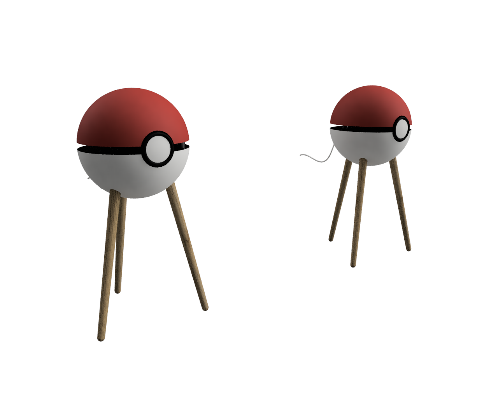
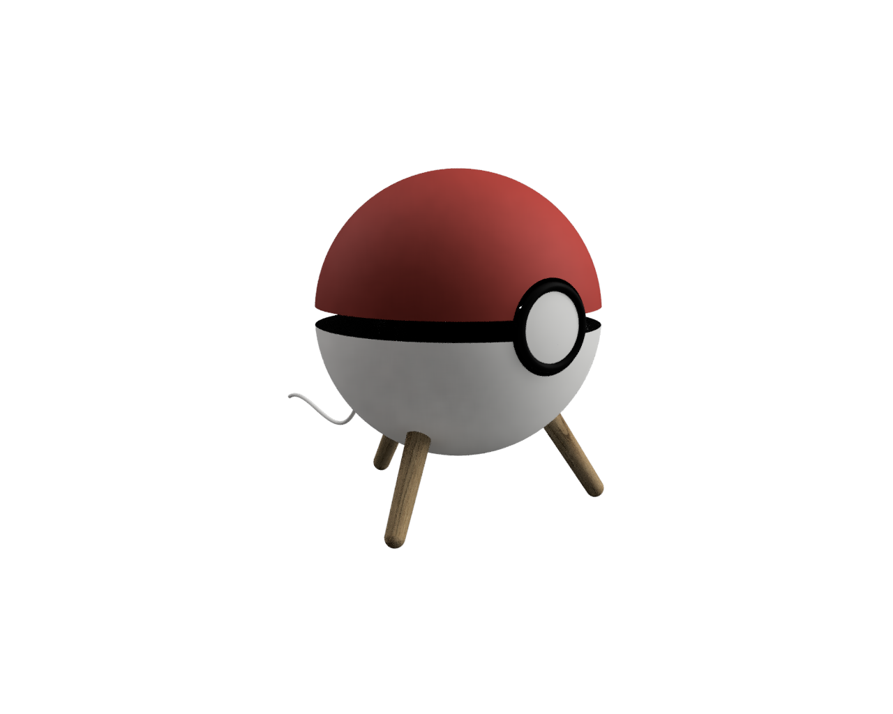

# Poké-Enceinte - La Sphère Audiophile Ultime

## Description
La Poké-Enceinte est une enceinte audiophile d'exception, fruit d'une collaboration unique entre Tristan, expert en acoustique, et Simon, passionné de mécanique et d'embarqué. Ce projet fusionne les dernières avancées en acoustique et traitement du signal avec un design inspiré de l'univers Pokémon.

Tristan a consacré sa carrière à perfectionner l'art du son, avec une thèse sur la correction des non-linéarités des haut-parleurs et une expérience en traitement du signal chez Devialet. Simon, quant à lui, apporte son savoir-faire en mécanique et systèmes embarqués pour faire de la Poké-Enceinte un objet à la fois performant et esthétique.

---

## Caractéristiques Techniques
### 🎵 Performances Acoustiques
- **Basses jusqu'à 0 Hz** : Système de woofers en push-push et caisson clos pour une extension basse-fréquence inégalée.
- **Sphère pulsante d'Olson** : Haut-parleurs au centre d'un caisson sphérique pour une dispersion parfaite.
- **Surface Rayonnante Maximale** : Placement des haut-parleurs sur la plus grande section de la sphère.
- **Transmission Laser S-PDIF** : Connectivité sans fil entre deux enceintes sans compression ni délai (uniquement pour le modèle sans compromis).
- **Conception Coaxiale** : Medium, tweeter et woofer alignés pour une reconstruction parfaite du front d'onde.
- **Woofers de 350 mm en push-push** (uniquement pour le modèle sans compromis).

### 🎭 Design et Matériaux
- **Design Mélancolique** : Inspiré par l'univers Pokémon, avec des éléments nostalgiques.
- **Cri de Pokémon Aléatoire** : Lors de l'appairage, une signature sonore unique retentit.
- **Bronze Massif** : Caisson en bronze moulé pour éliminer toute vibration parasite.
- **Trépied en Chêne** : Bois de forêts françaises pour un support stable et élégant.

### 🛍️ Connectivité et Streaming
- **WiFi Intégré** : Streaming direct depuis Spotify, Tidal, Apple Music et autres.

---

## Modèles Disponibles
- **Modèle Sans Compromis** : Enceinte de 45 cm de diamètre, conçue pour des basses dévastatrices et une puissance acoustique maximale. Ce modèle intègre deux woofers en push-push de 350 mm. **Prix : 3500€**.
- **Modèle Adapté à Tous les Intérieurs** : Version plus compacte de 20 cm de diamètre, idéale pour s'intégrer discrètement dans tous types de pièces. Ce modèle n'intègre pas la transmission laser S-PDIF. **Prix : 1000€**.

---

## DSP (Digital Signal Processing)
La Poké-Enceinte embarque un DSP ultra-performant contrôlant chaque voie en temps réel, appliquant les corrections mises au point par Tristan :
- **Correction des Non-Linéarités des Moteurs**
- **Dérive Thermique des Suspensions**
- **Saturation Ferromagnétique**
- **Effet Doppler** : Élimination de l'intermodulation entre fréquences éloignées.
- **Couplage Électromagnétique** : Compensation de la non-linéarité liée à l'excursion des haut-parleurs.
- **Correction de Pièce** : Micros de calibration intégrés pour adapter l'acoustique à votre environnement.
- **Contrôle de Puissance** : Optimisation de la réponse acoustique.

### 🌍 Amplification
- **Amplificateurs Classe D** : Trois amplis classe D par enceinte pour une puissance et une efficacité maximales.
- **Compensation de Délai** : Compensation des temps de propagation entre haut-parleurs.

---

## Pourquoi Choisir la Poké-Enceinte ?
La Poké-Enceinte ne se contente pas d'être un haut-parleur, c'est une expérience sensorielle, un hommage à la passion audiophile et à l'innovation. Elle incarne la fusion parfaite entre la rigueur scientifique et la créativité ludique.

---

## Créateurs
- **Tristan** : Acousticien et spécialiste du traitement du signal
- **Simon** : Ingénieur en mécanique et systèmes embarqués

Rejoignez-nous dans cette aventure sonore et laissez-vous transporter par la Poké-Enceinte !

